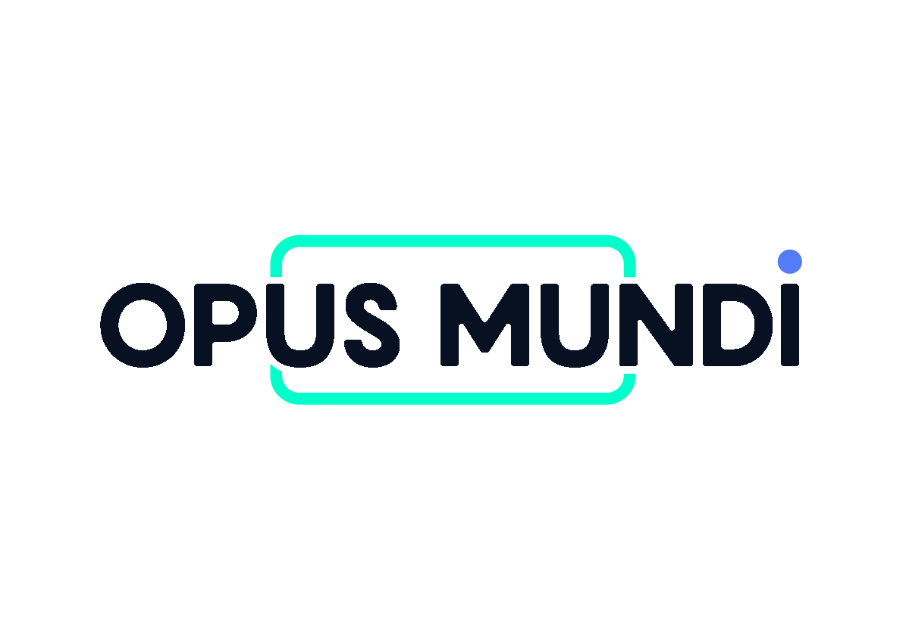
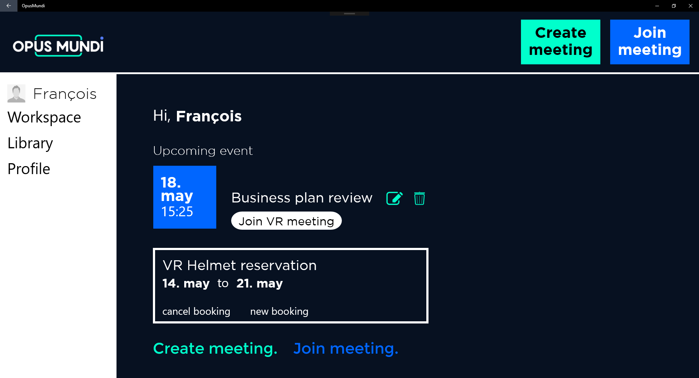
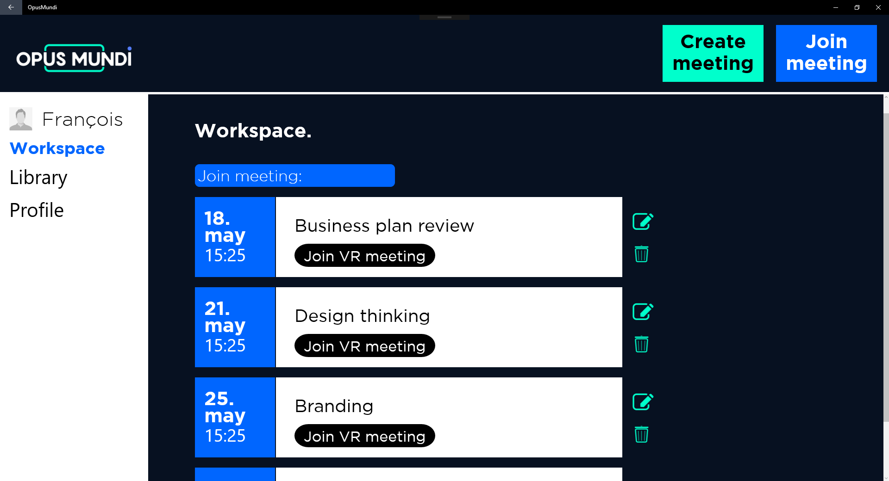

# Opus-Mundi
Immersing into shared knowledge

## What does it use?
  - UWP

## Why this project ?
The goal here was to imagine the campus of tomorrow for schools.

As a student, I’d like to :
● work with my team in an isolated, collaborative environment.
● work in fully equipped workspaces that never miss any tool.
● access qualitative knowledge whenever and from wherever I want.
● to have a 24/7 access to coworking.
● practice face-to-face consulting case interviews.
● have access to the best technological tools.

## To do
- [ ] virtual reality example (actually, it's just a panoramic photo to scroll)

## Can I help you?
Of course ! By trying to do the tasks of the todo section, by giving advices or by hitting the :star: button !
